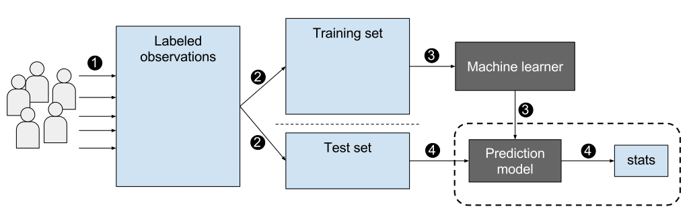
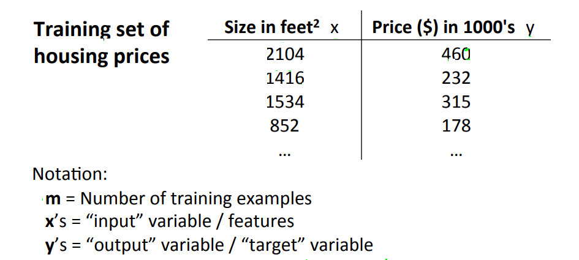
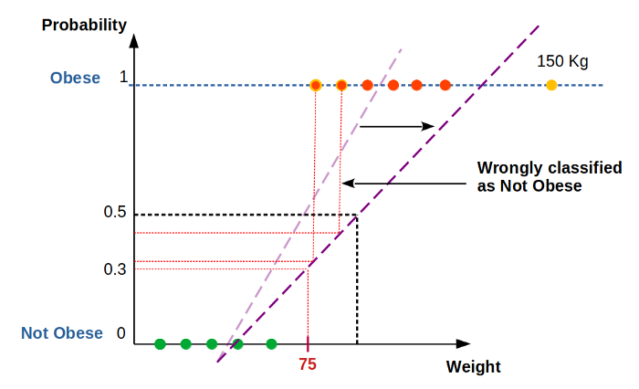

**Artificial Intelligence** is purely math and scientific exercise but when it becomes computational, it starts to solve human problems.

**Machine Learning** is a subset of Artificial Intelligence. ML is the study of computer algorithms that improve automatically through experience. ML explores the study and construction of algorithms that can learn from data and make predictions on data. Based on more data, machine learning can change actions and responses which will make it more efficient, adaptable, and scalable. [source](https://www.analyticsvidhya.com/blog/2021/03/everything-you-need-to-know-about-machine-learning/)

**Deep Learning** is a technique for implementing machine learning algorithms. It uses **Artificial Neural Networks** for training data to achieve highly promising decision making. The neural network performs micro calculations with computational on many layers and can handle tasks like humans.

## 1. What is Machine Learning?

### 1.1 Machine Learning definition

Machine learning is a discipline of artificial intelligence. The main objective is to create systems that are able to learn automatically, ie they are able to find complex patterns in large sets of data on their own.

Two definitions of Machine Learning are offered.

Arthur Samuel described it as: "**the field of study that gives computers the ability to learn without being explicitly programmed.**" This is an older, informal definition.

Tom Mitchell provides a more modern definition: "**A computer program is said to learn from experience E with respect to some class of tasks T and performance measure P, if its performance at tasks in T, as measured by P, improves with experience E**."

Example: playing checkers.

E = the experience of playing many games of checkers

T = the task of playing checkers.

P = the probability that the program will win the next game.

**Machine learning is the technology that is concerned with teaching computers different algorithms to perform different tasks, and making machines capable of taking care of themselves**. Different ideas are framed and fed to machines. There are mainly three recognized categories of framing ideas, which we reckon as the three types of machine learning. In general, any machine learning problem can be assigned to one of three broad classifications: **Supervised learning and Unsupervised learning and Reinforcement Learning.** [source](https://www.analyticssteps.com/blogs/types-machine-learning) [source](https://www.analyticssteps.com/blogs/what-confusion-matrix)

#### 1.1.1 Introduction Supervised Learning

Supervised learning is a set of techniques that allows future predictions based on behaviors or characteristics analyzed in historical data. In supervised learning, we are given a data set and already know what our correct output should look like, having the idea that there is a relationship between the input and the output. Supervised learning problems are categorized into "regression" and "classification" trying to predict results within a continuous output, meaning that we are trying to map input variables to some continuous function. In a classification problem, we are trying to map input variables into discrete categories. [source](https://blogs.nvidia.com/blog/2018/08/02/supervised-unsupervised-learning/)

A labeled dataset of animal images would tell the model whether an image is of a dog, a cat, etc.. Using which, a model gets training, and so, whenever a new image comes up to the model, it can compare that image with the labeled dataset for predicting the correct label. [source](https://intellipaat.com/blog/supervised-learning-vs-unsupervised-learning-vs-reinforcement-learning/)

There are two main areas where supervised learning is useful: **classification problems** and **regression problems**.

 

 

[source](https://www.congrelate.com/18-machine-learning-algorithm-for-classification-gif/)

**classification problems**

Classification problems ask the algorithm to predict a discrete value, identifying the input data as the member of a particular class, or group. In a training dataset of animal images, that would mean each photo was pre-labeled as cat, koala or turtle. The algorithm is then evaluated by how accurately it can correctly classify new images of other koalas and turtles.

[source](https://developers.google.com/machine-learning/guides/text-classification/?hl=it-CH)

**regression problems**

A regression problem is when the output variable is a real or continuous value, such as “salary” or “weight”. Many different models can be used, the simplest is the linear regression. It tries to fit data with the best hyper-plane which goes through the points.

**Linear Regression vs Logistic Regression** [source](https://www.javatpoint.com/linear-regression-vs-logistic-regression-in-machine-learning)

Linear Regression and Logistic Regression are the two famous Machine Learning Algorithms which come under supervised learning technique. Since both the algorithms are of supervised in nature hence these algorithms use labeled dataset to make the predictions. But the main difference between them is how they are being used. The Linear Regression is used for solving Regression problems whereas Logistic Regression is used for solving the Classification problems.

**Linear Regression:**

- Linear Regression is one of the most simple Machine learning algorithm that comes under Supervised Learning technique and used for solving regression problems.
- It is used for predicting the continuous dependent variable with the help of independent variables.
- The goal of the Linear regression is to find the best fit line that can accurately predict the output for the continuous dependent variable.
- If single independent variable is used for prediction then it is called Simple Linear Regression and if there are more than two independent variables then such regression is called as Multiple Linear Regression.
- By finding the best fit line, algorithm establish the relationship between dependent variable and independent variable. And the relationship should be of linear nature.
- The output for Linear regression should only be the continuous values such as price, age, salary, etc.

**Logistic Regression:** 

- Logistic regression is one of the most popular Machine learning algorithm that comes under Supervised Learning techniques.
- It can be used for Classification as well as for Regression problems, but mainly used for Classification problems.
- Logistic regression is used to predict the categorical dependent variable with the help of independent variables.
- The output of Logistic Regression problem can be only between the 0 and 1.
- Logistic regression can be used where the probabilities between two classes is required. Such as whether it will rain today or not, either 0 or 1, true or false etc.
- Logistic regression is based on the concept of Maximum Likelihood estimation. According to this estimation, the observed data should be most probable.
- In logistic regression, we pass the weighted sum of inputs through an activation function that can map values in between 0 and 1. Such activation function is known as **sigmoid function** and the curve obtained is called as sigmoid curve or S-curve. 

| Linear Regression                                            | Logistic Regression                                          |
| :----------------------------------------------------------- | :----------------------------------------------------------- |
| Linear regression is used to predict the continuous dependent variable using a given set of independent variables. | Logistic Regression is used to predict the categorical dependent variable using a given set of independent variables. |
| Linear Regression is used for solving Regression problem.    | Logistic regression is used for solving Classification problems. |
| In Linear regression, we predict the value of continuous variables. | In logistic Regression, we predict the values of categorical variables. |
| In linear regression, we find the best fit line, by which we can easily predict the output. | In Logistic Regression, we find the S-curve by which we can classify the samples. |
| Least square estimation method is used for estimation of accuracy. | Maximum likelihood estimation method is used for estimation of accuracy. |
| The output for Linear Regression must be a continuous value, such as price, age, etc. | The output of Logistic Regression must be a Categorical value such as 0 or 1, Yes or No, etc. |
| In Linear regression, it is required that relationship between dependent variable and independent variable must be linear. | In Logistic regression, it is not required to have the linear relationship between the dependent and independent variable. |
| In linear regression, there may be collinearity between the independent variables. | In logistic regression, there should not be collinearity between the independent variable. |

##### 1.1.1.1 **Simple Linear Regression**

Recall that in regression problems, we are taking input variables and trying to result function. Linear regression with one variable is also known as "univariate linear regression." Univariate linear regression is used when you want to predict a single output value y from a single input value x. We're doing supervised learning here, so that means we already have an idea about what the input/output cause and effect should be.

**The Hypothesis Function**

Our hypothesis function has the general form: 

Note that this is like the equation of a straight line. We give to    values for   and   to get our estimated output  .In other words, we are trying to create a function called that is trying to map our input data to our output data.

**Cost Function**

We can measure the accuracy of our hypothesis function by using a cost function. This takes an average (actually a fancier version of an average) of all the results of the hypothesis with inputs from x compared to the actual output y.

This function is otherwise called the "Squared error function", or "Mean squared error". Now we are able to concretely measure the accuracy of our predictor function against the correct results we have so that we can predict new results we don't have. If we try to think of it in visual terms, our training data set is scattered on the x-y plane. We are trying to make straight line  which passes through this scattered set of data. Our objective is to get the best possible line. The best possible line will be such so that the average squared vertical distances of the scattered points from the line will be the least. In the best case, the line should pass through all the points of our training data set. In such a case the value of    will be 0.

**Gradient descent**

1.1.1.2 **Multiple Linear Regression**

https://ai.plainenglish.io/why-dont-we-approach-to-classification-problems-using-linear-regression-in-machine-learning-8edcca89448

Linear regression with multiple variables is also known as "multiple linear regression".We now introduce notation for equations where we can have any number of input variables.

Now define the multiple form of the hypothesis function as follows, accommodating these multiple features:

In order to develop intuition about this function, we can think about as the basic price of a house, as the price per square meter, as the price per   floor,etc.  will be the number of square meters in the house, the number of floors, etc.

Using the definition of matrix multiplication, our multivariable hypothesis function can be concisely represented as:

**Why Can’t We Use Linear Regression To Solve A Classification Problem?** [source](https://ai.plainenglish.io/why-cant-we-use-linear-regression-to-solve-a-classification-problem-68edf1a3261b)

Linear regression and Logistic regression are two of the earliest machine learning algorithms that came into existence. Both of them are supervised machine learning algorithms.

Linear regression is used when the output data is continuous in nature. While Logistic regression is used when the output data is discrete in nature.

But have you ever wondered why is that so? Why can’t we use Linear regression to solve a classification problem where the output data is discrete in nature? And if we can solve a classification problem using Linear regression, then why do we need Logistic regression in the very first place?

The answers to these questions are very interesting and this article intends to enlighten you with the answers. So let’s try and understand the need for Logistic regression using a real-world example.

Obesity is one of the major health problems in the world right now as it is seen as a root cause of many diseases.

**“**[***Obesity is responsible for 4.7 million premature deaths each year.\***](https://ourworldindata.org/obesity#obesity-is-responsible-for-4-7-million-premature-deaths-each-year)**”**

That’s a lot!!!

Let’s assume that you are a researcher at a very reputed health organization. Your work is to identify the obesity percentage of a country.

You have a dataset that consists of the weights of people.

To gain speedy and accurate results, you take the help of machine learning algorithms to identify if a person is obese or not based on his weight.

From the overview, you can easily identify that this is a binary classification problem where if a person is above a certain weight, let’s say 75 kg, then he is considered **obese (1)** and if a person is below 75kg, then he is considered **not obese (0)**

So let’s see if Linear regression can be used to identify if a person is obese or not based on his weight…

**Will Linear Regression Help You To Classify If A Person Is Obese Or Not?**

As the next step in your research journey, you start training your Linear regression model.

You plot a 2-dimensional graph with weight on the x-axis and the probability that a person is obese or not on the y-axis.

You classify the sample data in such a way that if a person is below 75kg, he is considered as not obese and if a person is above 75kg, he is considered obese. In short, we are categorizing or classifying people as obese or not obese based on their weight.

Keep in mind that we are using **Linear regression** to classify people as obese or not obese based on their weight. So after classifying a sample dataset, we draw a line of best fit through the data points. The line of best fit is drawn in such a way that the distance between the line and all the data points is minimum.

After drawing the line of best fit, suppose we enter a new data point say 80 kg. Will Linear regression be able to classify this data point as obese or not obese? Let’s have a look.

On the y-axis, the probability associated with 75 kg is kept as 0.5. Here, the condition is that, if a person’s weight is 75 kg, then there is a 50% chance that he is obese and a 50% chance that he is not obese. This means, if a person’s weight is greater than 75 Kg, then the probability will always be greater than 0.5 and hence that person will be considered obese. Similarly, if a person’s weight is less than 75 Kg, then the probability will always be less than 0.5 and the person will be considered not obese.

Therefore, for a person who weighs 80 kg, the probability will be greater than 0.5 and hence he will be classified as obese.

And for a person who weighs 60 Kg, the probability will be less than 0.5 and hence he will be classified as not obese.

**Always remember that Linear Regression is highly affected by the inclusion of an outlier.**

Suppose, during our initial classification, an outlier gets added to the graph. Say 150 Kg. Because of this outlier, the position of the line of best fit completely changes.

Now, this my new best-fit line. As per our problem statement, if a person is above 75 Kg, we are considering that person as obese. But now, because of the new line of best fit, the probability associated with 75 Kg is less than 0.5 Hence it will be classified as not obese which is absolutely wrong.
And with that, all the data points whose probability comes below 0.5 as per the new line of best fit will be considered as not obese.

Therefore, just by the inclusion of one outlier, the entire result goes for a toss and the error rate increases drastically. There is another problem with Linear regression. Suppose, a new weight gets added to our data. Let the new weight be 180 kg. In this case, if we try to find out the probability of a person being obese or not with respect to this weight, then the probability comes out to be greater than 1.

This is an absolutely absurd result since the probability of any event cannot be greater than 1. Similarly, there can be a scenario where the output probability associated with weight will be less than zero. Which again does not make any sense.

Hence looking at these scenarios, we are now absolutely sure that we cannot use Linear regression to solve a classification problem.

1.1.1.2 **Logistic Regression**

Logistic regression is a statistical model that in its basic form uses a logistic function to model a binary dependent variable, although many more complex extensions exist. In regression analysis, **logistic regression** is estimating the parameters of a logistic model (a form of binary regression).

**The Hypothesis Function**

The image that depicts the working of the Logistic regression model [source]( https://www.analyticsvidhya.com/blog/2021/07/an-introduction-to-logistic-regression/):

A linear equation (z) is given to a sigmoidal activation function (σ) to predict the output (ŷ).

To evaluate the performance of the model, we calculate the loss. The most commonly used loss function is the mean squared error.

But in logistic regression, as the output is a probability value between 0 or 1, mean squared error wouldn’t be the right choice. So, instead, we use the cross-entropy loss function.

The cross-entropy loss function is used to measure the performance of a classification model whose output is a probability value.

Learn more about the cross-entropy loss function from [here](https://en.wikipedia.org/wiki/Cross_entropy).

**Cost Function**

The cost function represents optimization objective i.e. we create a cost function and minimize it so that we can develop an accurate model with minimum error.

#### 1.1.2 Introduction Unsupervised Learning

Clean, perfectly labeled datasets aren’t easy to come by. And sometimes, researchers are asking the algorithm questions they don’t know the answer to. That’s where unsupervised learning comes in. The training dataset is a collection of examples without a specific desired outcome or correct answer. 

This type of machine learning algorithm learns from a dataset without any labels. The algorithm can automatically classify or categorize the input data. The application of unsupervised learning mainly includes cluster analysis, association rule or dimensionality reduce. [source](https://www.ecloudvalley.com/mlintroduction/) [source](https://intellipaat.com/blog/supervised-learning-vs-unsupervised-learning-vs-reinforcement-learning/)

#### 1.1.3 Introduction Reinforcement Learning

After discussing on supervised and unsupervised learning models, now, let me explain to you reinforcement learning. As it is based on neither supervised learning nor unsupervised learning, what is it? To be straight forward, in reinforcement learning, algorithms learn to react to an environment on their own.

To be a little more specific, reinforcement learning is a type of learning that is based on interaction with the environment. It is rapidly growing, along with producing a huge variety of learning algorithms that can be used for various applications.

To begin with, there is always a start and an end state for an agent (the AI-driven system); however, there might be different paths for reaching the end state, like a maze. This is the scenario wherein reinforcement learning is able to find a solution for a problem. Examples of reinforcement learning include self-navigating vacuum cleaners, driverless cars, scheduling of elevators, etc. [source](https://intellipaat.com/blog/supervised-learning-vs-unsupervised-learning-vs-reinforcement-learning/)

### Gradient Descent

So we have our hypothesis function and we have a way of measuring how well it estimate the parameters in hypothesis function. That's where gradient descent comes in.

https://blogs.nvidia.com/blog/2018/08/02/supervised-unsupervised-learning/

https://developers.google.com/machine-learning/guides/text-classification/?hl=it-CH

https://www.geeksforgeeks.org/regression-classification-supervised-machine-learning/

https://www.congrelate.com/18-machine-learning-algorithm-for-classification-gif/

https://vinodsblog.com/

https://www.diegocalvo.es/en/machine-learning-supervised-unsupervised/

https://www.mathworks.com/help/stats/machine-learning-in-matlab.html

https://towardsdatascience.com/a-beginners-guide-to-regression-analysis-in-machine-learning-8a828b491bbf

https://www.oatext.com/a-supervised-machine-learning-approach-to-generate-the-auto-rule-for-clinical-decision-support-system.php

https://www.v7labs.com/blog/supervised-vs-unsupervised-learning

https://www.analyticsvidhya.com/blog/2021/03/everything-you-need-to-know-about-machine-learning/

https://intellipaat.com/blog/supervised-learning-vs-unsupervised-learning-vs-reinforcement-learning/

https://search.slidegeeks.com/search?af=cat1%3apowerpointtemplates&lbc=slidegeeks&method=and&p=Q&ts=custom&w=roadmap&cnt=200

https://intellipaat.com/blog/tutorial/machine-learning-tutorial/

https://www.analyticssteps.com/blogs/introduction-machine-learning-supervised-and-unsupervised-learning

https://vinodsblog.com/2018/11/28/machine-learningml-introduction-to-basics/

https://vinodsblog.com/2018/10/15/everything-you-need-to-know-about-convolutional-neural-networks/

https://vinodsblog.com/2021/01/01/2021-the-year-of-transformer-deep-learning/

https://vinodsblog.com/2020/07/28/deep-learning-introduction-to-boltzmann-machines/

https://vinodsblog.com/2018/11/28/machine-learningml-introduction-to-basics/

https://vinodsblog.com/2018/11/28/machine-learningml-introduction-to-basics/

https://vinodsblog.com/2019/03/31/supervised-vs-unsupervised-machine-learning/

https://vinodsblog.com/2018/03/26/machine-learning-introduction-to-its-algorithms-mlalgos/

https://vinodsblog.com/2018/03/11/the-exciting-evolution-of-machine-learning/

https://vinodsblog.com/2018/03/11/the-exciting-evolution-of-machine-learning/

https://argoshare.is.ed.ac.uk/healthyr_book/binary-logistic-regression.html

https://www.analyticsvidhya.com/blog/2021/07/an-introduction-to-logistic-regression/

https://www.geeksforgeeks.org/ml-cost-function-in-logistic-regression/

https://laptrinhx.com/derivative-of-log-loss-function-for-logistic-regression-3891259225/

https://www.sail.name/2018/06/03/the-fourth-week-homework-of-ML-Stanford/

http://saitcelebi.com/tut/output/part1.html

https://www.mariakhalusova.com/posts/2017-11-17-logistic-regression-cheat-sheet/

https://sebastianraschka.com/faq/docs/regularized-logistic-regression-performance.html
